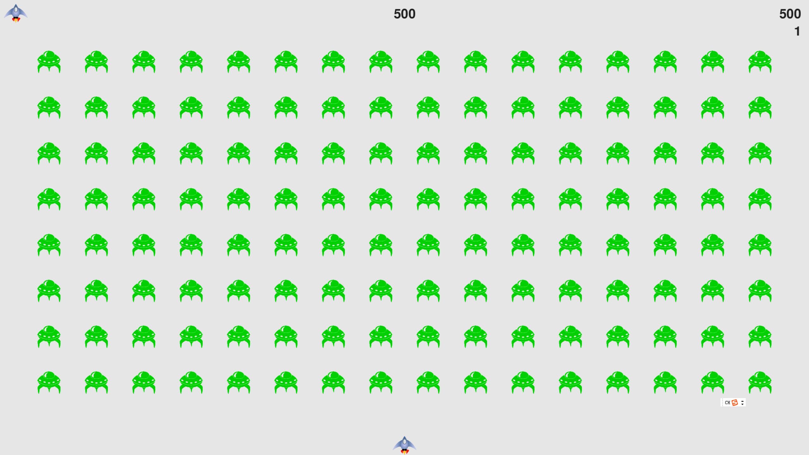

<!-- @format -->

# 项目介绍

[《python 编程：入门到实践》](https://www.ituring.com.cn/book/2784)第二版 第十二章项目.
外星人入侵，射击小游戏，使用 pygame 实现。  
本文件夹下代码除了按照书上指导实现外，还做了部分延伸。延伸部分见：[扩展](#扩展)

# 运行

1、 使用如下命令安装 pygame

```shell
python -m pip install --user pygame
# 将依赖存储到文件中
pip freeze > requirements.txt
```

2、运行 alien_invasion.py

```shell
python aline_invasion.py
```

# 效果




# 扩展

1.  添加游戏音乐: pygame.mixer
2.  外星人也可以向飞船射击
3.  飞船添加盾牌,格挡子弹
4.  按下 P 键开始游戏
5.  创建一组按钮，可以选择起始难度
6.  最高分保存在本地，方便下次运行继续读取
7.  保证游戏前几轮能够过,游戏难度逐渐上升

# bugfix

1. 按 Q 退出仍然有问题
2. 这里 Sprite 是做什么的？
3. 了解下 [pygame](https://www.pygame.org/)
