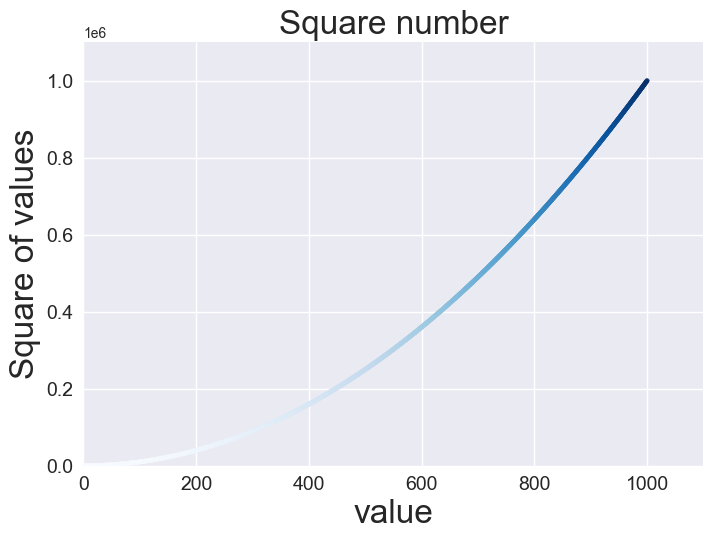
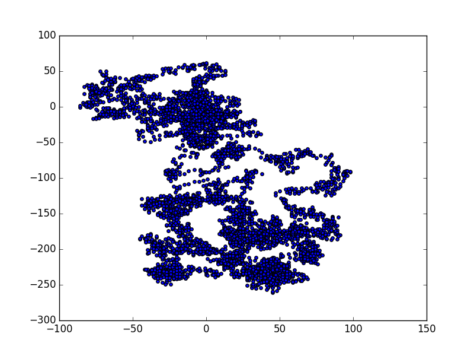
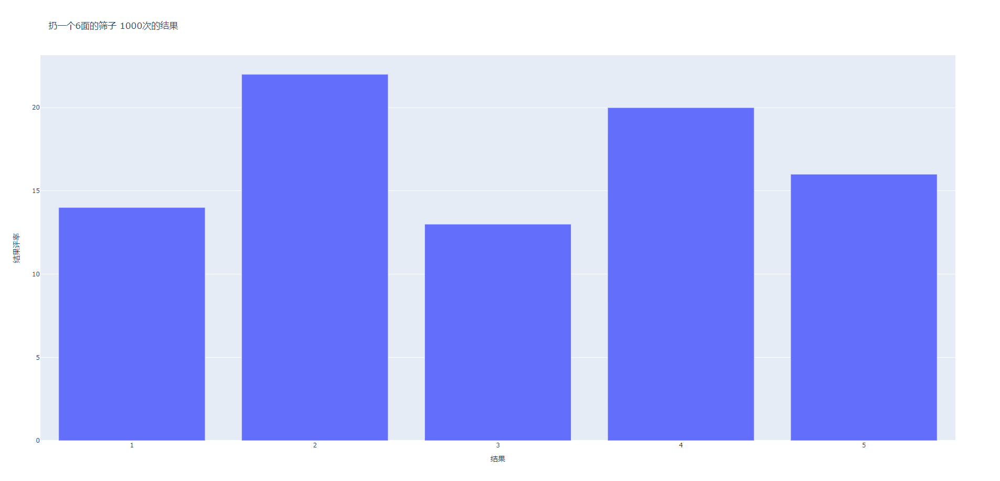
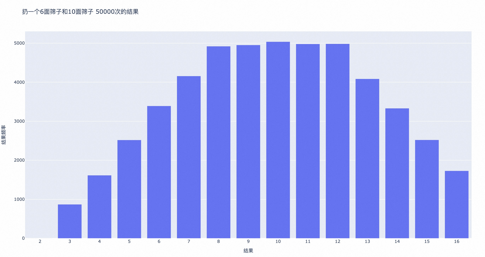
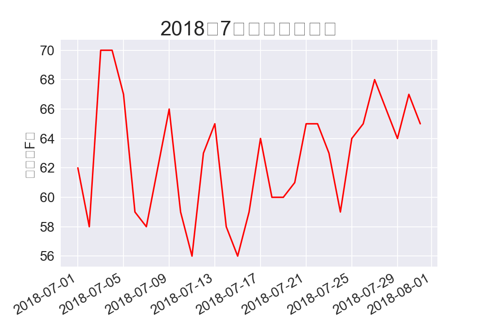
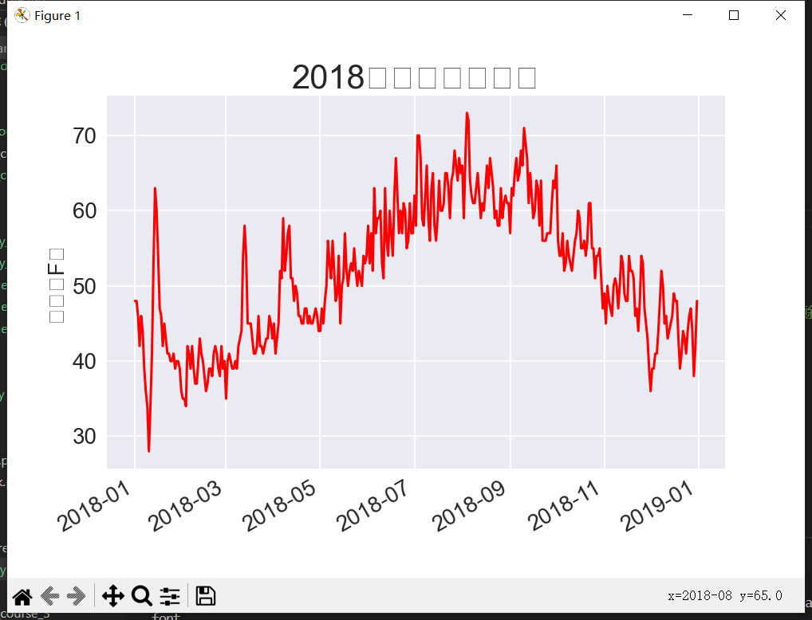
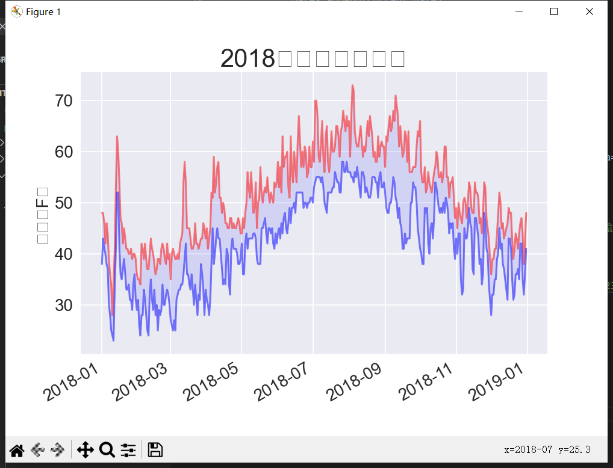
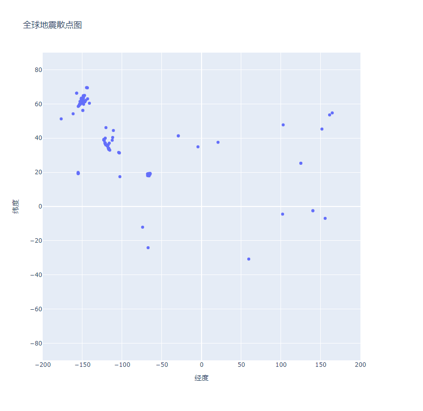
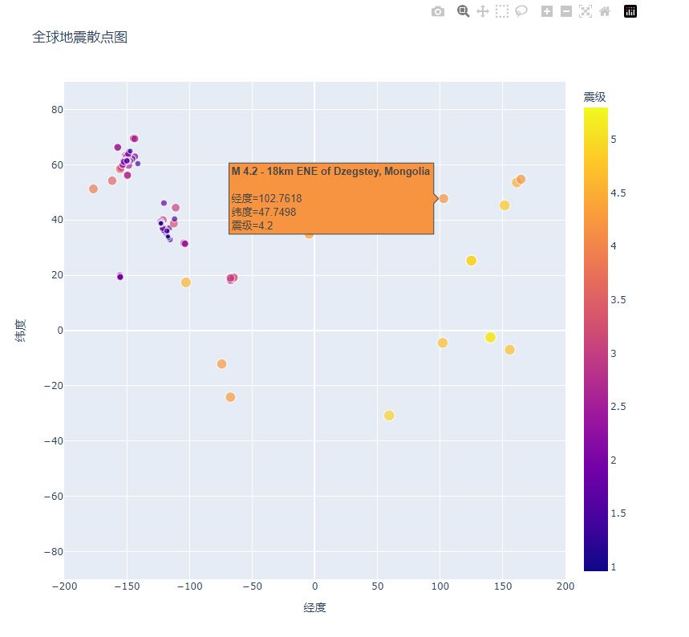

<!-- @format -->

# 项目介绍

[《python 编程：入门到实践》](https://www.ituring.com.cn/book/2784)第二版 第十二章项目 - 数据可视化部分。各章节内容如下

**第 15 章 生成数据**

1、用 `matplotlib` 绘制图表，并通过`random` `range` 生成随机数据  
2、用 `plotly` 绘制图表

**第 16 章 下载数据**

1、如何将`csv`转换为图表，并以加利福利亚州几个地方的年天气数据为例，做绘图。  
2、读取`json`格式的全球地震散点数据，并做绘图

**第 17 章 通过 Web 获取数据并展示**
1、通过 `request`获取 github 数据，并以柱状图的形式进行展示，同时优化表格样式。

本文件夹下代码除了按照书上指导实现外，还做了部分延伸。延伸部分见：[扩展](#扩展)

# 运行

安装需要的依赖

```shell
# 图表格工具
python -m pip install --user matplotlib
python -m pip install --user plotly
# pandas 是数据分析工具
python -m pip install --user pandas
# 网络请求
python -m pip install --user requests
```

`matplotlib`、`plotly` 都是数据可视化 `python` 库

区别是: `plotly` 支持交互可视化，其输出格式哟 `html`、`svg`、`png` 等多种格式

这要比 `matplotlib` 多。当然 `plotly` 更新，所以在社区积累支持上，可能就不够。

两者更多区别，参考一下这个[文章](https://zhuanlan.zhihu.com/p/148748125)

`plotly` 入门文档可以参考: [plotly user with python](https://plotly.com/python/getting-started/)

关于 `plotly` 中更多的图表设置，可参考: [plotly reference](https://plotly.com/python/reference/)

依赖安装玩会后，可通过在命令行里直接 `python` + 文件名运行程序，主要代码文件如下:

`scatter_squares.py` `mpl_squares.py`: 生成线图

`dice_visual.py`: 模拟投多个骰子 N 次的结果，并以 HTML 形式展示

`die_visual.py`: 模拟投一个骰子 N 次的结果，并以 HTML 形式展示

`rw_visual.py`: (random walk)生成随机点图，设置点样式等

`sitka_highs.py`: 锡特卡地区高低温折线图

`death_valley_highs_lows.py`: 死亡谷地区高低温折线图（对读取数据出现的错误做了兼容`ValueError`）

`eq_explore_data.py`: 全球地震散点图

`python_repos.py`: 获取`github`上最热的`python`项目,并生成图表

还有一些辅助性文件

`die.py`: 骰子类

`random_walk.py`: 生成随机性的 x,y 点数组，传入数量进行控制

`show_color_scales.py`: 查看`plotly`支持的色阶

`hn_article.py`: 从 Hacker News 网站批量获取数据

# 运行效果



<p align='center'>线图，颜色渐变(scatter_squares.py)</p>
<br/>



<p align='center'>（随机漫步）随机图形生成(rw_visual.py)</p>
<br/>

<div style="display:inline-block">
    
    
</div>

<p align='center'>骰子结果概率(die_visual.py / dice_visual.py)</p>
<br/>

<div style="display:inline-block">
    
    
    
</div>

<p align='center'>阿拉斯加温度线图(sitka_highs.py)</p>
<br/>

<div style="display:inline-block">
    
    
</div>

<p align='center'>全球地震散点图(eq_explore_data.py)</p>

# Tips

`CSV` 是常见的 `excel` 格式，其全称是: `comma-separated values`, 也就是用逗号分隔的字符串。
比如这是一行`CSV`格式的天气数据

```csv
<!-- 阿拉斯加锡特卡2018年1月1日天气数据 -->
"USW00025333", "SITKA AIRPORT, AK US", "2018-01-01", "0.45",, "48", "38"
```
