<!-- @format -->

# 项目介绍

[《python 编程：入门到实践》](https://www.ituring.com.cn/book/2784)第二版 第二部分项目，项目 3 Web 应用程序部分。

该部分通过 `django` 框架展示了如何快速的搭建 web 服务器，以及配置路由、数据库、用户权限等。各章节如下:

**第 18 章 从 Django 入手**
介绍了如何使用`python`在本地运行一个网站，以及如何在 `django` 中编写模板，并展示相应内容。

**第 19 章 用户账户**
小节内介绍了，`django`中如何配置用户，以及对网站内容如何配置实现区分用户进行展示。

**第 20 章 设置应用程序样式并部署**
该小节内，演示了通过 `django-bootstrap4`插件，将已有的网页美化。以及如何在`heroku`开通托管部署。

# 说在前面

还是和前面的章节一样，先说明下文的主要目标。读者可以通过此段文字决定是否要继续读下去。

> django 框架，是一个便捷的 web 框架，能给你迅速创建专属的 CMS(内容管理系统)。有后台，有前台。里面从用户权限，到数据表创建管理。都被做到了一起。
> 对于一个**希望迅速启动的项目**而言，是非常高效的。当然，不排除有其他框架做的更好。
> 高效的背面,是后续扩张的困难。
> 所以要先明确，你希望用它做什么， **技术应当被应用，而不仅仅是为了学习而学习。**

# 运行

### 1、创建并激活虚拟环境

考虑到同一个机器上可能安装了多个版本的 `python` 以及相同包的不同版本，为了避免互相冲突干扰。书中推荐我们为接下来的 web 项目创建专属的虚拟环境，虚拟环境可指定虚拟环境中的`python`版本，并且互相独立，他处（包括宿主自身）的环境变化都不会影响到虚拟环境内部（简言之，就是一个独立的虚拟机）。

```shell
# 创建名为 ll_env 虚拟环境
python -m  venv ll_env

# 激活虚拟环境
# windows
ll_env\Scripts\activate
# mac os
# source ll_env/bin/activate

# 虚拟环境激活后，会在命令行最开始展示（ll_env）,windows下类似于这个效果
# (ll_env) C:\Users\Administrator\Desktop\github\python-learning-demo\python_crash_course\python_crash_course_3>

# 在虚拟环境下，安装 django
pip install django

```

`venv` 是 `python`内部用于创建虚拟环境的模块。简单使用介绍可以参考: [什么是 Venv](https://zhuanlan.zhihu.com/p/285631652)

### 2、遇到的问题

在`windows`下运行，可能会遇到了如下错误:

```text
ll_env\Scripts\Activate : 无法加载文件 C:\Users\Administrator\Desktop\github\python-learning-demo\python_crash_course\python_crash_course_3\ll_env\Scripts\Activate.ps1，因为在此系统上禁止运行脚本。有关详细信息，请参阅 https://go.microsoft.com/fwlink/?LinkID=135170 中的 about_Execution_Policies。
所在位置 行:1 字符: 1
+ ll_env\Scripts\Activate
+ ~~~~~~~~~~~~~~~~~~~~~~~
    + CategoryInfo          : SecurityError: (:) []，PSSecurityException
    + FullyQualifiedErrorId : UnauthorizedAccess
```

查了下，是[运行脚本的权限不够](https://www.sharepointdiary.com/2014/03/fix-for-powershell-script-cannot-be-loaded-because-running-scripts-is-disabled-on-this-system.html)。启动命令行的时候记得以管理员身份运行即可。

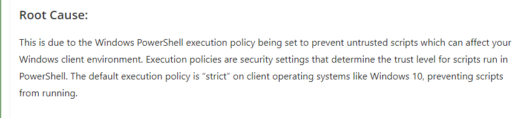

**<p align='center'>错误原因</p>**

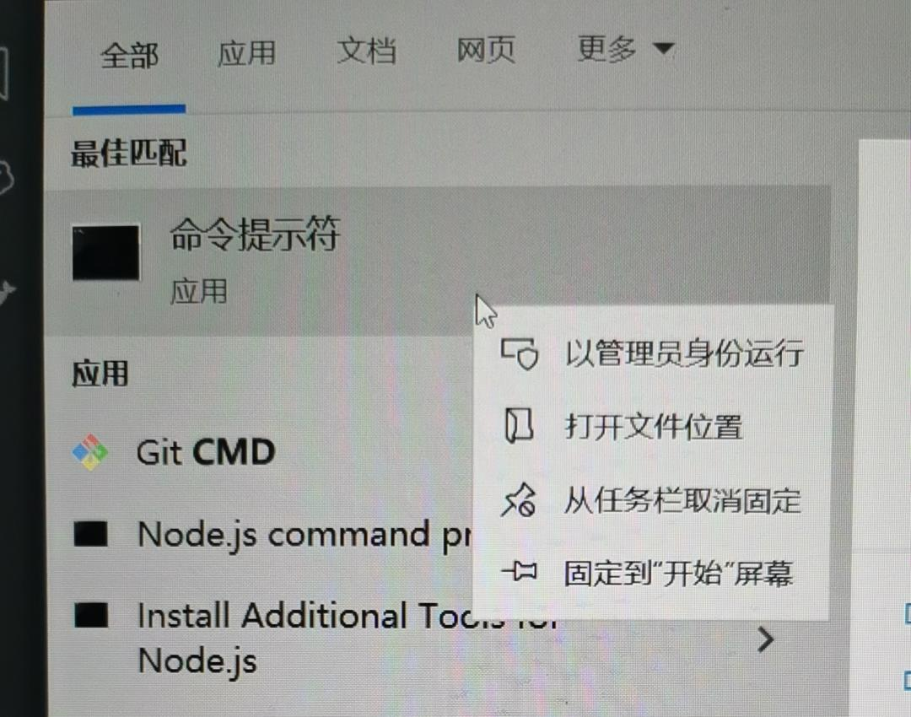

**<p align='center'>以管理员身份运行</p>**

### 3、初始化项目

```shell
# 使用django创建项目
django-admin startproject learning_log .
```

命令执行完毕后，查看新出现的目录，如下:

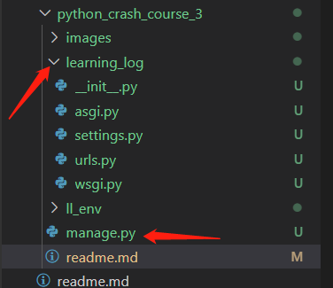

**<p align='center'>django 创建的文件</p>**

| 文件          | 作用                                                                                                                     |
| ------------- | ------------------------------------------------------------------------------------------------------------------------ |
| `settings.py` | 指定 `Django`如何与系统之间交互以及如何管理项目                                                                          |
| `urls.py`     | 告诉 `Django` 应该创建哪些页面来响应浏览器的请求                                                                         |
| `wsgi.py`     | 帮助 `Django` 向浏览器提供它创建的文件，是 web 服务器网关接口（web server gateway interface）的缩写                      |
| `manage.py`   | 控制 `Django` 生成的网站，根据不同的子命令，选择进一步执行的任务（_后续的启动服务器、迁移数据等操作都是通过调用该文件_） |

网站需要数据库存储数据，下面来创建数据库(在本文中是 `sqlite`)

```shell
# migrate 是迁移的意思，但实际上，首次执行migrate 会让django确保数据库和项目当前状态匹配
# 换言之，django 将会新建数据库和其中的表
python manage.py migrate
```

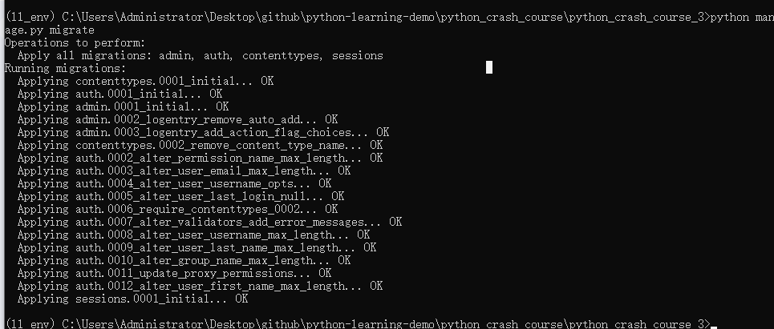

**<p align='center'>创建数据库</p>**

在使用 `SQLite`的新项目时，首次执行 `migrate`(迁移)命令时，`Django` 会创建新数据库

接下来，使用这条命令启动项目

```shell
python manage.py runserver
```

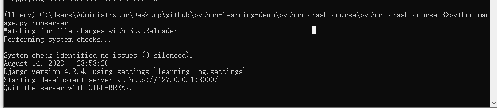

**<p align='center'>启动项目</p>**

启动后，打开 `http://127.0.0.1:8000` 可以看到如下页面效果

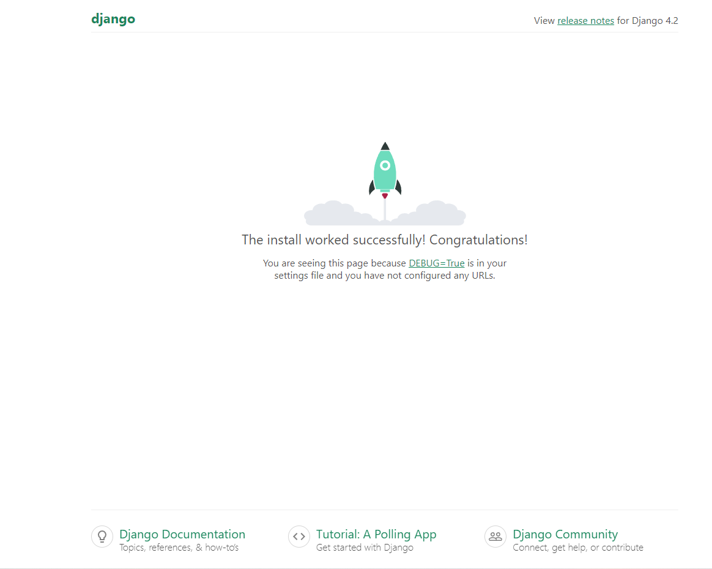

**<p align='center'>网站样式</p>**

### 4、创建应用 learning_logs

然后创建我们的应用：学习笔记（ `learning_logs` ），下面将涉及两个概念， 项目（`project`）、 应用（`app`）
在一个项目下，可以安装多个应用。下面展示在学习笔记 （ `learning_log` ） 项目中，创建 `users`、`learning_log` 等多个应用。

| 应用名称     | 作用                              |
| ------------ | --------------------------------- |
| learning_log | 学习笔记网站                      |
| users        | 学习网站用户管理                  |
| bootstrap4   | 网站样式主题 ，控制各个页面的样子 |

```shell
# 创建一个名为learning_logs的应用
python manage.py startapp learning_logs
```

应用目录下的文件大致如下

| 文件        | 作用                                                                      |
| ----------- | ------------------------------------------------------------------------- |
| `admin.py`  | 将注册的数据模型，挂载到应用中                                            |
| `apps.py`   | 定义应用相关配置，本文中没有用到                                          |
| `models.py` | 定义所需要的数据模型                                                      |
| `urls.py`   | 定义应用 leading_logs 下的 URL，返回 `views.py` 中定义的 `view` 对象      |
| `views.py`  | 定义各个路径 URL 对应的视图对象，会将请求参数和其他参数一并传入模板文件中 |

生成的应用需要添加到项目中，打开 `learning_log` 下的 `settings.py` 在其中 `INSTALLED_APPS` 添加上自己应用的名称。

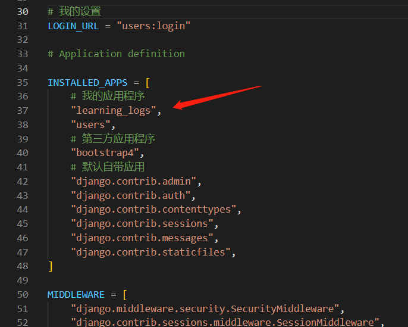

**<p align='center'>将自己的 app 添加到项目中</p>**

### 5、创建 Topic 数据模型

添加完应用后，继续为应用添加数据模型，数据模型存储在应用文件夹下的 `models.py`。下面为 `learing_logs` 添加一个叫做 `Topic` 的模型，表示学习笔记中的主题。

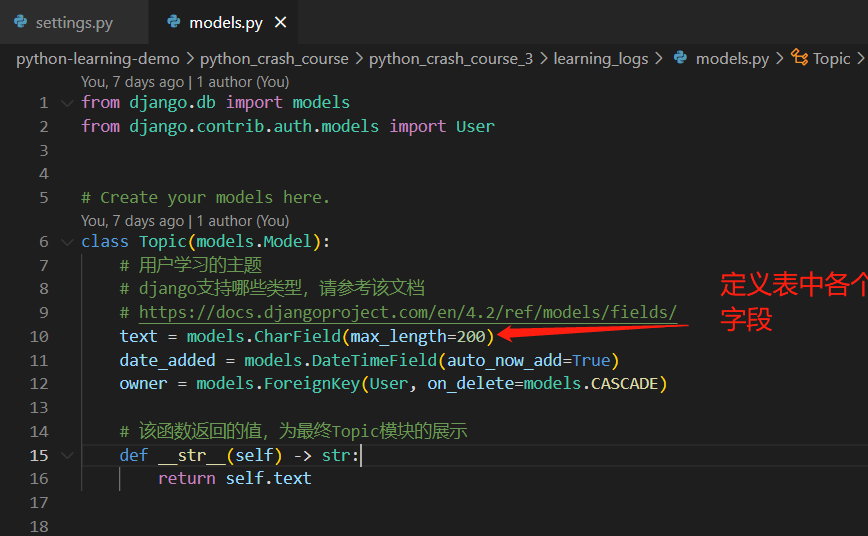

**<p align='center'>Topic 模型的定义</p>**

但上面并不会真正在数据库中创建表格，执行下面的语句继续创建数据表:

```shell
# makemigrations命令让django根据app设置去确定如何修改数据库，并生成对应的python脚本
python manage.py makemigrations learning_logs
# 执行上面生成的python脚本，才能最终完成对数据库的修改
python manage.py migrate
```

`makemigrations` 会生成类似存储进程的文件（ `db.sqlite3` ），内部大概是这样的，可以看到里面有 SQL 语句。

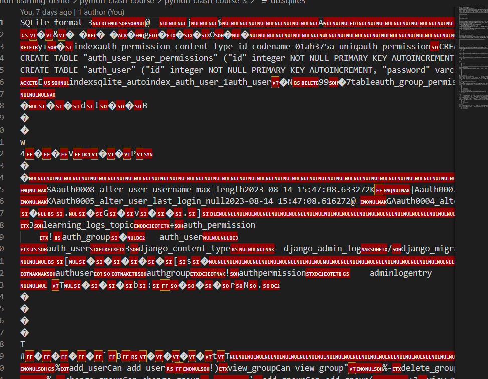

**<p align='center'>存储数据的文件</p>**

在 `learning_logs` 应用中执行 `makemigrations` 生成改动，最后再执行 `migrate` 将改动输入到数据库中。创建成功，执行结果如下图:

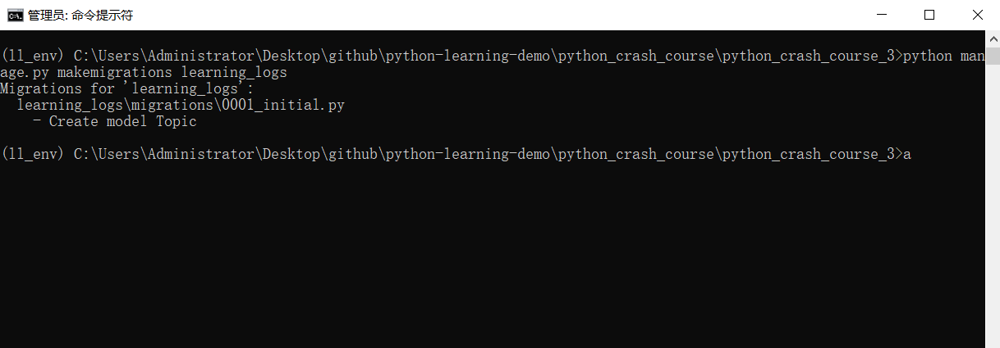

**<p align='center'>生成修改数据库的存储进程</p>**

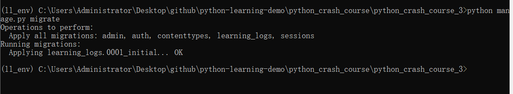

**<p align='center'>应用存储进程修改表</p>**

后续如果需要对 `Topic` 博客主题进行修改（如扩增字段），都要先在应用（ `learning_logs` ）下的 [`models.py`](./learning_logs/models.py) 中修改、新增对应的表。然后依序分别执行 `makemigrations` `migrate` 将改动落实到数据库中。

在学习笔记应用中，我们会创建如下的表（数据模型）：

| 模型名称 | 定义                                       |
| -------- | ------------------------------------------ |
| Topic    | 学习日志博客分类主题，例如国际象棋、攀岩   |
| Entry    | 主题下的实例，比如国际象棋下的学习笔记一篇 |

上面展示了在`django`中如何定义模型和数据表，这是为了后续存储我们的数据。但应用还需要添加用户，对数据进行管理。先创建一个超级用户:

### 5、创建网站用户和 Entry 数据模型

```shell
python manage.py createsuperuser
```

创建用户过程，会要求输入邮箱、用户名、密码等。按要求输入后，即可创建用户。

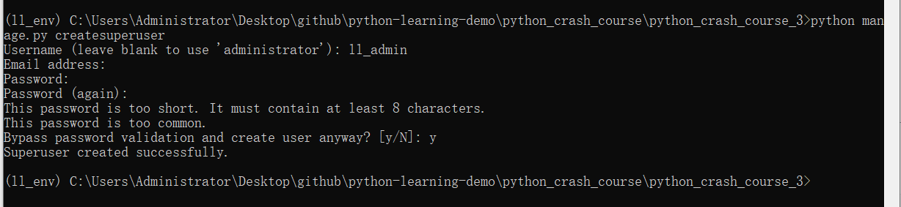

**<p align='center'>创建管理员</p>**

随后，将 `learning_logs` 应用添加到项目中，如下：

```python
urlpatterns = [
  # 默认身份验证的UR: 如 login/logout
  path("", include("django.contrib.auth.urls")),
]
```

[代码链接](https://github.com/weisiwu/python-learning-demo/blob/70a0da080f313e79999ff27eacca9de7396b36dd/python_crash_course/python_crash_course_3/learning_log/urls.py#L23)

修改完数据库、创建用户后需要重启服务器，改动才能生效。

```shell
# 重启服务器
python manage.py runserver
```

打开 [管理后台](http://localhost:8000/admin)，输入用户名和密码登录


**<p align='center'>登录界面</p>**

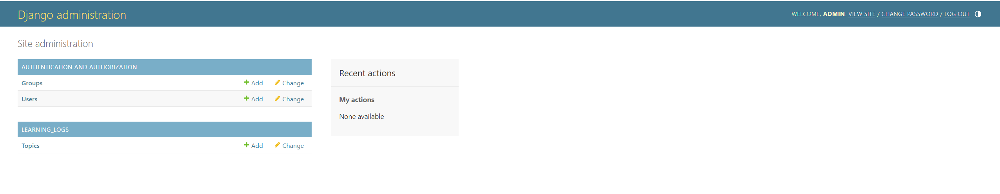

**<p align='center'>管理后台</p>**

继续创建 `Entry` 数据模型，用来存储分类主题下的实例，最终代码查看: [`models.py`](./learning_logs/models.py)

### 6、通过交互式终端查看数据

这里提下，`django` 也提供了交互式终端，可以用来实时查看数据。

```shell
python manage.py shell
# 进入python shell
>>> from leaning_logs.model import Topic
>>> Topic.objects.all()
# 获取所有主题
<QuerySet [<Topic: Chess>, <Topic: Rock Climbing>]>
>>> topics = Topic.objects.all()
>>> for topic in topics:
>>>     print(topic.id, topic)
# 遍历并输出
1 Chess
2 Rock Climbing
```

### 7、创建 URL 映射、视图、模板

对网站来说，数据库准备就绪后，就可以开始写后续业务逻辑了，主要有以下这两类:

1. 相应 URL 的逻辑，根据 URL 不同，调用不同的服务逻辑
2. 不同 URL 对应的页面视图逻辑，和前端（jser）常写的 `html` 类似

后面针对学习笔记网站的每个页面，我们都会按照如下步骤进行创建。

1、定义 `URL`

> 每个 `URL` 都被映射到特定的视图

2、编写视图（ `view` ）

> 视图获取并处理页面所需的数据

3、编写模板 ( `template` )

> 模板定义页面的整体结构

学习笔记包含如下页面:

| 页面名称                 | URL                        | 视图                                                                                                                                                                                     |
| ------------------------ | -------------------------- | ---------------------------------------------------------------------------------------------------------------------------------------------------------------------------------------- |
| 网站首页                 | ""                         | [ `views.index` ](https://github.com/weisiwu/python-learning-demo/blob/70a0da080f313e79999ff27eacca9de7396b36dd/python_crash_course/python_crash_course_3/learning_logs/views.py#L11)    |
| 所有主题类型的列表页     | topics/                    | [`views.topics`](https://github.com/weisiwu/python-learning-demo/blob/70a0da080f313e79999ff27eacca9de7396b36dd/python_crash_course/python_crash_course_3/learning_logs/views.py#L20)     |
| 特定主题类型的详情页面   | topics/<int:topic_id>/     | [`views.topic`](https://github.com/weisiwu/python-learning-demo/blob/70a0da080f313e79999ff27eacca9de7396b36dd/python_crash_course/python_crash_course_3/learning_logs/views.py#L30)      |
| 用于添加新主题类型的页面 | new_topic/                 | [`views.new_topic`](https://github.com/weisiwu/python-learning-demo/blob/70a0da080f313e79999ff27eacca9de7396b36dd/python_crash_course/python_crash_course_3/learning_logs/views.py#L46)  |
| 用于添加主题下实例的页面 | new_entry/<int:topic_id>/  | [`views.new_entry`](https://github.com/weisiwu/python-learning-demo/blob/70a0da080f313e79999ff27eacca9de7396b36dd/python_crash_course/python_crash_course_3/learning_logs/views.py#L66)  |
| 用于编辑主题下实例的页面 | edit_entry/<int:entry_id>/ | [`views.edit_entry`](https://github.com/weisiwu/python-learning-demo/blob/70a0da080f313e79999ff27eacca9de7396b36dd/python_crash_course/python_crash_course_3/learning_logs/views.py#L90) |

下面，以 `topics/int:topic_id/` 为例，讲解一下，如何添加页面。

#### 1、定义 URL

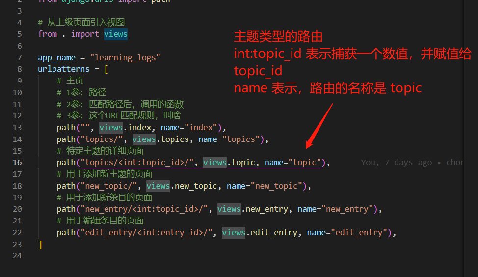

**<p align='center'>定义前往的主题类型的路由</p>**

代码位置: [ `topics/<int:topic_id>/` ](https://github.com/weisiwu/python-learning-demo/blob/70a0da080f313e79999ff27eacca9de7396b36dd/python_crash_course/python_crash_course_3/learning_logs/urls.py#L16)

#### 2、编写视图

在 `views.py` 中注册处理 `topics/<int:topic_id>/` 的逻辑。

```python
# 作为views，实际上。返回具体视图和模板，并组装数据。
# 在运行topic函数前，先下运行 login_required
@login_required
def topic(request, topic_id):
    # 显示单个主题以及所有的条目
    topic = Topic.objects.get(id=topic_id)
    # 访问其他用户的数据，拒绝访问
    if topic.owner != request.user:
        # raise 抛出异常
        raise Http404
    # 按照添加的主题类型日期进行排序
    # date_added前面的-号，表示按降序排列
    entries = topic.entry_set.order_by("date_added")
    # 组装数据结构
    context = {"topic": topic, "entries": entries}
    # learning_logs/topic.html 是将要范围的模板
    # context 是要注入到模板中的数据
    return render(request, "learning_logs/topic.html", context)
```

上述代码的位置如下:

[ `views.py` ](./learning_logs/views.py)

#### 3、编写模板

模板名称为：`topic.html`

```html
<!-- 页面继承base.html -->
<!-- 在 django 中，html文件在返回给用户前，按照django模板规则进行解析 -->
<!--  中可以写逻辑规则 -->

<!-- 定义页面header部分 -->

<!-- {{}}中嵌入变量，topic是从views.py中传入的 -->
<h3>{{topic}}</h3>
<!-- 表示header部分结束 -->
 
<p><a href=""> Add new entry</a></p>
<!-- entries 是从views.py中传入的 -->

<div class="card mb-3">
  <!-- 是在模板中的备注的标签 -->
   这里要特别注意， date:'M d, Y H:i' ,如果在date: 后多加一个空格，就会报错 
  <h4 class="card-header">
    {{ entry.date_added|date:'M d, Y H:i' }}
    <small><a href="">edit entry</a></small>
  </h4>
  <!-- 过滤器linebreaks将含过滤付的长文字转换为浏览器可以理解的格式 -->
  <div class="card-body">{{ entry.text|linebreaks }}</div>
</div>
<!-- 表示当前for如果为空的情况，需要怎么展示 -->

<p>There are no entries for this topic yet.</p>
 
```

[ `topic.html` ](./learning_logs/templates/learning_logs/topic.html)

按照上述步骤继续创建[其他模板](https://github.com/weisiwu/python-learning-demo/tree/70a0da080f313e79999ff27eacca9de7396b36dd/python_crash_course/python_crash_course_3/learning_logs/templates/learning_logs)

### 8、创建管理用户应用并将其和文章数据关联

模板创建完毕后，需要创建用户应用，用于管理后续访问网站的用户，让用户之间的数据彼此隔离。

```shell
# 创建 users 应用
python manage.py startapp users
```

然后将 `users` 添加到项目中

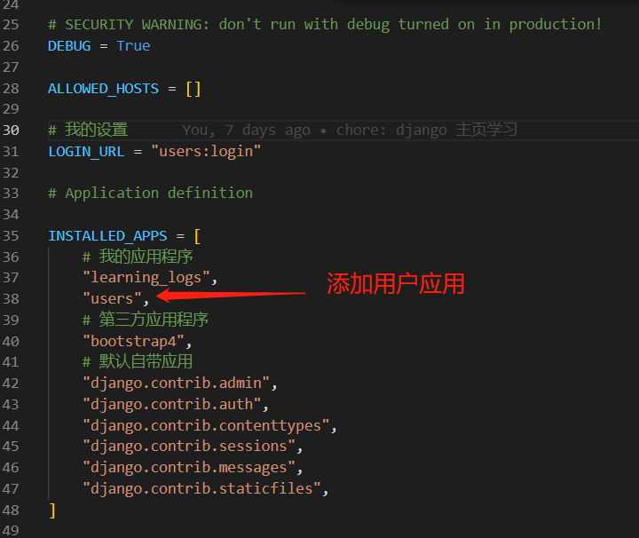

**<p align='center'>添加 users</p>**

给 `users` 应用下的 url 链接配置设置到文件中

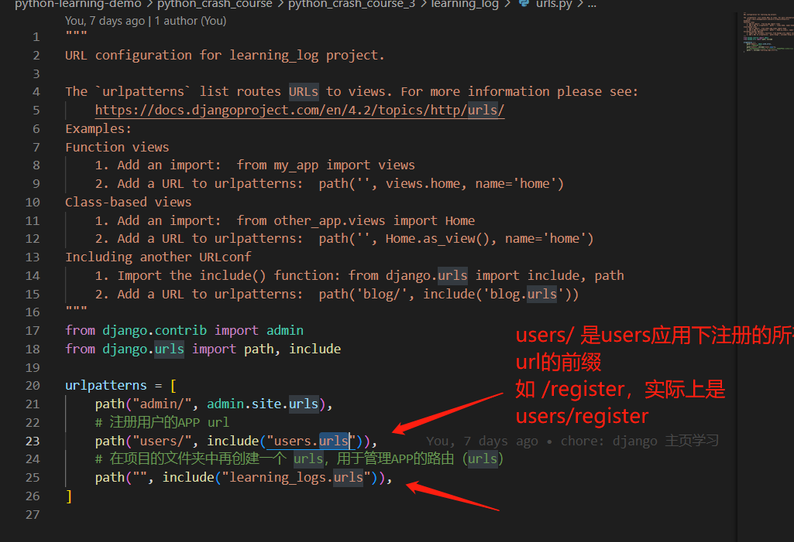

**<p align='center'>将应用 URL 添加到项目 URL 配置中</p>**

`users` 应用的创建不赘述，

在 `views.py` 中，有这样的代码

```python
from django.contrib.auth.decorators import login_required

@login_required
def topic(request, topic_id):
  ...
  return render(request, "learning_logs/topic.html", context)
```

`@login_required` 是 `python` 的装饰器语法，这会让 `python` 在运行 `topic` 函数前，先运行 `login_required` 函数。
`login_required` 用于检查用户是否登录，以登录才会运行 `topic`，否则重定向到登录页面。 而重定向的逻辑， 则同样是通过配置，由 `django` 生成。
在 `learning_log` 项目下的 `settings.py` 进行配置：

```python
# users 应用下 名为 login 的路由
LOGIN_URL = "users:login"
```

还缺少最关键的一步，目前所有的数据，和用户数据没有关联。为此需要将 `User` 应用关联到 `learning_logs` 应用。
这里需要用到 [外键](https://zh.wikipedia.org/zh-hans/%E5%A4%96%E9%94%AE)

如下:


**<p align='center'>add_foreign_key</p>**

创建完外键后，需要重新迁移数据库，才能生效。  
在完成关联后，就可以查询到每个文档、主题的用户。最后一步需要过滤，防止用户访问到非本人的文档。  
[代码链接](https://github.com/weisiwu/python-learning-demo/blob/70a0da080f313e79999ff27eacca9de7396b36dd/python_crash_course/python_crash_course_3/learning_logs/views.py#L33)

```python
if topic.owner != request.user:
    # 非用户名下文章，不允许访问，范围404
    # raise 抛出异常
    raise Http404
```

### 9、对网站应用样式模板 Bootstrap4

```shell
>>> from django.contrib.auth.models import User
>>> User.objects.all()
<QuerySet [<User: ll_admin>, <User: admin>]>
>>> for user in User.objects.all():
...     print(user.username, user.id)
...
ll_admin 1
admin 2
```
