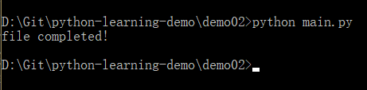
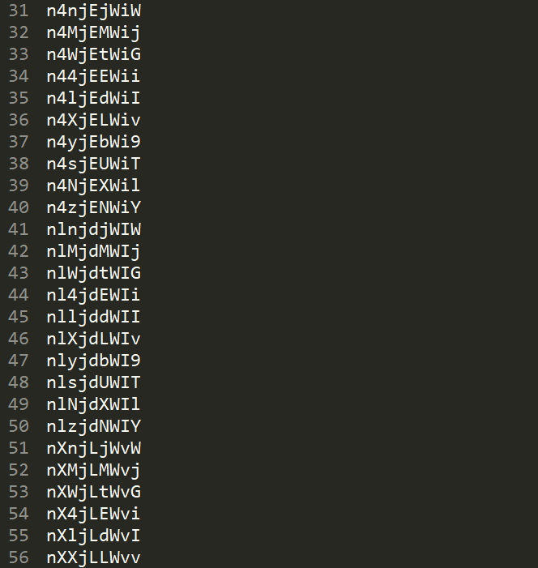

<!-- @format -->

## describe

做为 Apple Store App 独立开发者，你要搞限时促销，为你的应用生成激活码（或者优惠券），使用 Python 如何生成 200 个激活码（或者优惠券）？  
as a apple developer,you are mandated to generate 200 activation code,how would you do?

## result

1. 运行  
   
2. 结果预览  
   

## reference

1. [四亿个兑换码的生成/验证算法？](https://www.zhihu.com/question/29865340)
2. [Python 练习册，每天一个小程序](https://github.com/Yixiaohan/show-me-the-code)
3. [用 python 生成验证码图片](https://zhuanlan.zhihu.com/p/26528349)
4. [Python 练习第二题，生成激活码](https://zhuanlan.zhihu.com/p/25169905)

<!-- 背景图中生成随机线条 -->

```python
for i in range(5):
    line_color = (random.randint(0, 255), random.randint(0, 255), random.randint(0, 255)) # 干扰线的颜色随机生成
    start_point = (random.randint(0, width), random.randint(0, height))
    end_point = (random.randint(0, width), random.randint(0, height))
    draw.line([start_point, end_point], fill=line_color, width=2) # 在画布上绘制干扰线
```

---

**如何扭曲变形**
扭曲变形：对验证码字符进行扭曲变形。可以使用 Pillow 库中的 Image.transform() 方法来实现。

```python
image = image.transform((width, height), Image.PERSPECTIVE, data) # data 为变形参数
```

**如何噪点干扰**

```python
noise_level = 0.05  # 噪点级别
pixels = image.load()  # 获取像素数据
for i in range(image.width):
    for j in range(image.height):
        if random.random() < noise_level:
            noise_color = (random.randint(0, 255), random.randint(0, 255), random.randint(0, 255))
            pixels[i, j] = noise_color

```

在示例代码中，noise_level 表示噪点的级别，可以根据实际需要进行调整。代码遍历画布上的每个像素点，当随机数小于噪点级别时，将该像素点的颜色随机设置为噪点颜色。

**激活码原理**
激活码的原理是通过加密算法和校验机制来验证软件或产品的合法性和授权许可。以下是一种常见的激活码的生成和验证原理：

生成激活码：激活码一般由一串随机字符或数字组成。生成激活码的过程通常包括以下步骤：

生成随机码：使用随机数生成器生成一串随机字符或数字作为激活码的基本内容。
加入控制位：为了增加激活码的安全性，通常在激活码中加入控制位，用于校验码的正确性。
加密处理：对激活码进行加密处理，使用特定的加密算法和密钥，将激活码转换为一串密文。
验证激活码：当用户输入激活码时，软件或产品会对激活码进行验证，以确定其合法性和授权许可。验证的过程通常包括以下步骤：

解密处理：使用相同的加密算法和密钥，将用户输入的激活码进行解密，还原为原始的随机码。
校验控制位：对解密后的随机码进行校验，验证控制位的正确性，以确定激活码是否被篡改过。
验证合法性：根据软件或产品的授权规则，判断激活码的合法性，包括有效期限、使用次数等条件。
需要注意的是，不同的软件或产品可能采用不同的加密算法和验证机制，以提高激活码的安全性和防止盗版。因此，具体的激活码生成和验证原理可能因软件或产品的不同而有所差异。

**激活码思路**
生成和验证激活码的思路如下：

1. 生成激活码：

   - 确定激活码的组成方式，例如由数字、字母或特殊字符组成。
   - 设定激活码的长度和格式要求。
   - 使用随机数生成器生成一串随机字符或数字作为激活码的基本内容。
   - 添加控制位，可以是校验码、校验和、哈希值等，用于验证激活码的正确性。
   - 对激活码进行加密处理，可以使用对称或非对称加密算法，使用密钥对激活码进行加密，生成一串密文作为最终的激活码。

2. 验证激活码：
   - 接收用户输入的激活码。
   - 对密文进行解密，还原为原始的随机码。
   - 校验控制位，验证激活码的正确性和完整性，以防止篡改。
   - 根据软件或产品的授权规则，判断激活码的合法性，包括有效期限、使用次数等条件。
   - 返回激活结果，如果激活码合法，则进行授权许可，否则提示激活码无效或过期。

需要注意的是，激活码的生成和验证过程可以根据具体需求进行定制和扩展，可以采用不同的加密算法和验证机制来增加激活码的安全性和防伪能力。同时，为了防止激活码的泄露和滥用，还可以采取一些额外的措施，如绑定硬件信息、联网验证等。

**激活码为什么需要控制位，为什么需要加密**

控制位与加密在激活码中起到不同的作用，下面分别进行解释：

1. 控制位：控制位是用于验证激活码的正确性和完整性的一部分信息。通过添加控制位，可以在激活码被验证时进行校验，以防止激活码被篡改或伪造。常见的控制位包括校验码、校验和、哈希值等。

   控制位的作用在于：

   - 防止激活码被非法修改，以保证激活码的完整性。
   - 确认激活码的有效性，防止使用无效或过期的激活码。

2. 加密：加密是将激活码进行转换，使其成为无法直接被读取的密文形式。通过加密，可以增加激活码的安全性，防止被未经授权的用户获取或破解。

   加密的作用在于：

   - 防止激活码被盗用或非法分发。
   - 增加激活码的安全性，防止激活码被破解或伪造。
   - 保护激活码中的敏感信息，如授权期限、产品版本等。

总的来说，控制位和加密是为了保证激活码在生成和验证过程中的完整性、正确性和安全性。控制位用于验证激活码的完整性和有效性，而加密则用于保护激活码的安全性和防止被盗用。这些措施可以提高软件或产品的授权管理能力，保护软件和产品的合法权益。

**根据软件或产品的授权规则，判断激活码的合法性，包括有效期限、使用次数等条件。 指的是什么**
根据软件或产品的授权规则，是指根据开发者或厂商事先设定的授权规则来验证激活码的合法性。这些授权规则可以包括以下条件：

1. 有效期限：指激活码可以使用的时间范围。开发者或厂商可以设定激活码的开始时间和结束时间，只有在有效期限内的激活码才被认为是合法的。

2. 使用次数限制：指激活码可以使用的次数。开发者或厂商可以设定激活码可以被使用的次数，一旦达到限制次数后，激活码将失效。

3. 设备绑定：指激活码是否绑定到特定的设备上。开发者或厂商可以限制激活码只能在特定的设备上使用，以防止激活码被非法传播和共享。

4. 功能限制：指激活码可以开启的功能或特性。开发者或厂商可以根据不同类型的激活码，设定不同的功能限制，以满足不同用户的需求。

通过对激活码进行验证和比对，软件或产品可以根据这些授权规则来判断激活码的合法性。如果激活码满足所有授权规则的条件，那么可以认为该激活码是合法的，并给予相应的授权许可。否则，激活码将被判定为无效或过期，无法进行授权使用。这样的授权规则可以帮助开发者或厂商有效地管理和控制软件或产品的授权使用范围。

**思考**
1、有真实的激活码示例吗？比如某些过期的激活码，和背后的工作原理？
