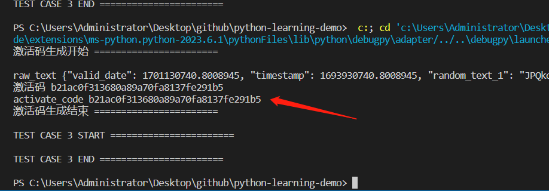
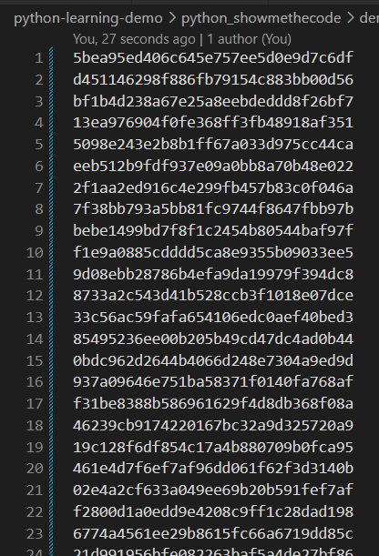

<!-- @format -->

## 简述

做为 Apple Store App 独立开发者，你要搞限时促销，为你的应用生成激活码（或者优惠券），使用 Python 如何生成 200 个激活码（或者优惠券）？  
as a apple developer,you are mandated to generate 200 activation code,how would you do?

该题分成两个部分:

### 1. **验证码**

生成图片验证码，获取验证码后，和用户填的值进行对比，确定用户是否通过验证。嗲用如下:

```python
code = VerifyCode(uuid).verify_code()
```

验证码对应的图片的位置在 `./output/code.png`， `code` 是刚生成的验证码值

#### 1、验证码的作用和生成思路

验证码的主要目的是防止自动化程序执行恶意活动，如恶意注册、暴力破解密码、爬取网站内容等。

1. 人类视觉识别： 验证码通常包含一些文字、数字、图像、图形或图案等，这些元素是为人类易于识别而设计的，但对计算机程序来说难以识别。

2. 生成随机性： 验证码的内容通常是随机生成的，增加计算机破解难度。

3. 时间限制： 验证码通常有一个时间限制，用户需要在一定时间内正确识别并输入验证码，否则会超时。

4. 多样性： 网站和应用程序可以使用不同类型和样式的验证码，以增加多样性，防止破解。

这里验证码程序入口: [verify_code](https://github.com/weisiwu/python-learning-demo/blob/ea8178d73e1abaa49ae81cb61b243243059d6375/python_showmethecode/demo01/main.py#L190)

主要思路如下:

1. 根据输入的用户 id(`uuid`)，查看有无已生成的在有效期内的验证码
2. 将用户输入的配置项和默认配置项合并
3. 生成随机字符串
4. 通过随机字符串生成图片
5. 给图片添加背景图和噪点，加大识别难度
6. 扭曲文字
7. 生成图片，保存到本地，并打开

#### 1、生成验证码随机文字

[Python 列表解析式和生成表达式](https://zhuanlan.zhihu.com/p/63986999)

```python
def verify_code_generate(self):
   # 这里的写法是，列表解析
   code_arr = [
      self.config["verify_code_set"][random.randint(0, self.code_set_len - 1)]
      for index in range(0, self.config["verify_code_len"])
   ]
   self.code = "".join(code_arr)
```

#### 2、生成验证码图片背景

```python
alpha_cover = Image.new("L", (width, height), 128)  # 128 表示半透明
alpha_cover_draw = ImageDraw.Draw(alpha_cover)

# 给验证码图添加背景和随机线条
for i in range(50):
   line_color = random.randint(0, 255)  # 干扰线的颜色随机生成
   start_point = (random.randint(0, width), random.randint(0, height))
   end_point = (random.randint(0, width), random.randint(0, height))
   # 在画布上绘制干扰线
   alpha_cover_draw.line([start_point, end_point], fill=line_color, width=1)

image.paste(alpha_cover, (0, 0), alpha_cover)
```

#### 3、验证码文字扭曲变形

使用 Pillow 库中的 Image.transform() 方法来对字符进行扭曲变形

```python
twisted_text_image = twisted_text_image.transform(
   (width, height),
   Image.PERSPECTIVE,
   (1.0, 0.2, -50.0, 0.0, 1.5, -100.0, 0.0, 0.001, 1.0),
   Image.BILINEAR,
)
image.paste(
   ImageOps.colorize(twisted_text_image, (0, 0, 0), (255, 0, 0)), (50, 100)
)
```

#### 4、添加噪点干扰

```python
noise_level = 0.05  # 噪点级别

for i in range(image.width):
    for j in range(image.height):
        if random.random() < noise_level:
            noise_color = (random.randint(0, 255), random.randint(0, 255), random.randint(0, 255))
            # 对图片对象，对每个随机到的像素点修改颜色
            image.putpixel((x, y), noise_color)

```

`noise_level` 是噪点级别，遍历画布上的每个像素点，当随机数小于噪点级别时，将该像素点的颜色随机设置为噪点颜色。

#### 5、保存图片

```python
# 默认保存路径
save_path = f"{self.get_assets_path()}/output"

# 如调用时，传入保存路径，则不使用默认路径
if self.config["verify_code_save_path"]:
   save_path = f'{self.config["verify_code_save_path"]}'

if not os.path.isdir(save_path):
   # makedirs 可以递归创建目录
   os.makedirs(save_path)

self.path = f"{save_path}/{self.code}.png"
```

#### 6、运行结果

<div style="display:inline-block">
   
   
</div>

<p align='center'>生成的验证码</p>

### 2. **激活码**

#### 1、原理

激活码的原理是通过加密算法和校验机制来验证软件或产品的合法性和授权许可。

#### 2、生成激活码

一般有以下步骤：

> 1、生成随机码：使用随机数生成器生成一串随机字符或数字作为激活码的基本内容。
>
> 2、加入控制位：为了增加激活码的安全性，通常在激活码中加入控制位，用于校验码的正确性。
>
> 3、加密处理：对激活码进行加密处理，使用特定的加密算法和密钥，将激活码转换为一串密文。

#### 3、验证激活码

则一般如下:

> 1、解密处理：使用相同的加密算法和密钥，将用户输入的激活码进行解密，还原为原始的随机码。
>
> 2、校验控制位：对解密后的随机码进行校验，验证控制位的正确性，以确定激活码是否被篡改过。
>
> 3、验证合法性：根据软件或产品的授权规则，判断激活码的合法性，包括有效期限、使用次数等条件。

需要注意，为防止激活码的泄露和滥用，还可采用额外措施，如绑定硬件信息、联网验证等。

#### 4、为什么需要控制位，为什么需要加密

1. 控制位：用于验证激活码的正确性和完整性的一部分信息。通过添加控制位，可以在激活码被验证时进行校验，以防止激活码被篡改或伪造。常见的控制位包括校验码、校验和、哈希值等。

   控制位的作用在于：

> - 防止激活码被非法修改，以保证激活码的完整性。
> - 确认激活码的有效性，防止使用无效或过期的激活码。

2. 加密：加密是将激活码进行转换，使其成为无法直接被读取的密文形式。通过加密，可以增加激活码的安全性，防止被未经授权的用户获取或破解。

   加密的作用在于：

> - 防止激活码被盗用或非法分发。
> - 增加激活码的安全性，防止激活码被破解或伪造。
> - 保护激活码中的敏感信息，如授权期限、产品版本等。

总的来说，控制位和加密是为了保证激活码在生成和验证过程中的完整性、正确性和安全性。控制位用于验证激活码的完整性和有效性，而加密则用于保护激活码的安全性和防止被盗用。这些措施可以提高软件或产品的授权管理能力，保护软件和产品的合法权益。

#### 5、作用

根据软件或产品的授权规则，是指根据开发者或厂商事先设定的授权规则来验证激活码的合法性。这些授权规则可以包括以下条件：

1. 有效期限：指激活码可以使用的时间范围。开发者或厂商可以设定激活码的开始时间和结束时间，只有在有效期限内的激活码才被认为是合法的。

2. 使用次数限制：指激活码可以使用的次数。开发者或厂商可以设定激活码可以被使用的次数，一旦达到限制次数后，激活码将失效。

3. 设备绑定：指激活码是否绑定到特定的设备上。开发者或厂商可以限制激活码只能在特定的设备上使用，以防止激活码被非法传播和共享。

4. 功能限制：指激活码可以开启的功能或特性。开发者或厂商可以根据不同类型的激活码，设定不同的功能限制，以满足不同用户的需求。

通过对激活码进行验证和比对，软件或产品可以根据这些授权规则来判断激活码的合法性。如果激活码满足所有授权规则的条件，那么可以认为该激活码是合法的，并给予相应的授权许可。否则，激活码将被判定为无效或过期，无法进行授权使用。这样的授权规则可以帮助开发者或厂商有效地管理和控制软件或产品的授权使用范围。

#### 6、运行结果

<div style="display:inline-block">
   
</div>

<p align='center'>运行生成激活码</p>

生成的验证码存放在`activeCodeList.txt`文件中

<div style="display:inline-block">
   
</div>

<p align='center'>生成的激活码</p>

## 参考

1. [四亿个兑换码的生成/验证算法？](https://www.zhihu.com/question/29865340)
2. [Python 练习册，每天一个小程序](https://github.com/Yixiaohan/show-me-the-code)
3. [用 python 生成验证码图片](https://zhuanlan.zhihu.com/p/26528349)
4. [Python 练习第二题，生成激活码](https://zhuanlan.zhihu.com/p/25169905)

<!-- 背景图中生成随机线条 -->
