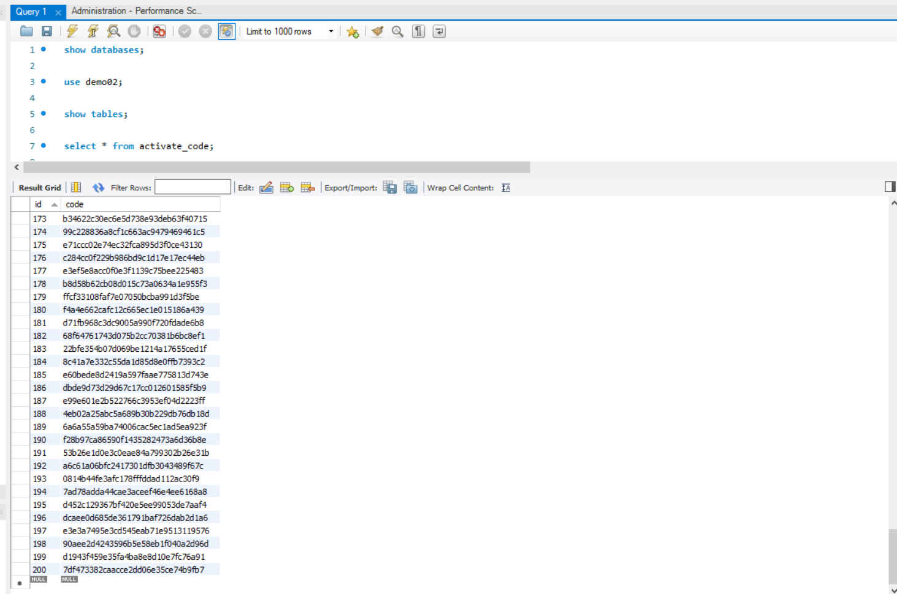

<!-- @format -->

## 简述

将 0001 题生成的 200 个激活码（或者优惠券）保存到 **MySQL** 关系型数据库中。

本次通过直接在机器上安装 [mysql](https://dev.mysql.com/downloads/installer/)进行测试

这里控制 `mysql` 数据库用的是 [`mysqlclient`](https://mysqlclient.readthedocs.io/)

```python
# 虽叫做 mysqlclient，实际引用时为 MySQLdb
import MySQLdb
```

运行程序

```shell
python main.py
```

## 运行结果



<p align='center'>查询插入数据库的数据</p>
<br/>

## 参考

1. [Python 文件 I/O](http://www.runoob.com/python/python-files-io.html)
2. [python 操作 mysql 数据库](http://www.runoob.com/python/python-mysql.html)
3. [Python 操作 MySQL 数据库的三种方法](http://blog.csdn.net/oscer2016/article/details/70257024)
4. [使用 mysql 命令行连接远程数据库 host 跳转](https://segmentfault.com/q/1010000010052719)
