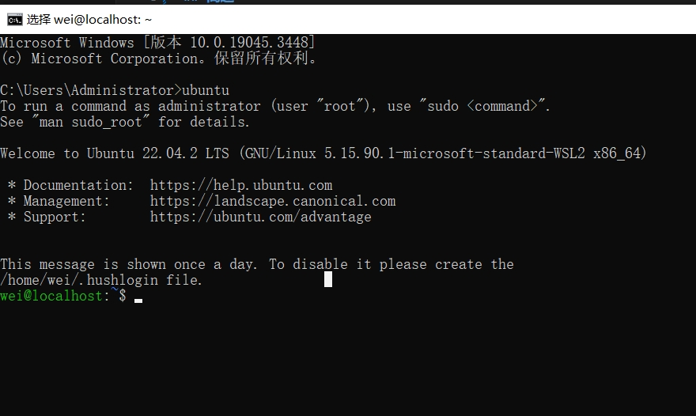
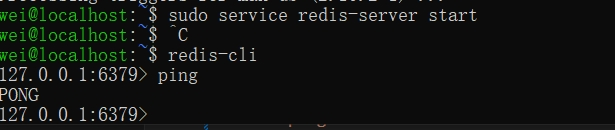

<!-- @format -->

## 简述

将 0001 题生成的 200 个激活码（或者优惠券）保存到 **Redis** 非关系型数据库中。

本人用的是 `windows` 机器， `Redis` 官方不支持该平台，但可通过激活 `WSL2` 来安装 `Redis`。如使用的是 类 linux、Mac 的机器，可直接安装，或查询是否支持 自己的机器: [Supported Platforms](https://docs.redis.com/latest/rs/installing-upgrading/install/plan-deployment/supported-platforms/)。

后续进入 `wsl` 需要先打开 `windows` 终端，然后输入安装的 `liunx` 发行版名称，我安装的是 `ubuntu` ，运行后就进入了 `wsl`。



<p align='center'>进入wsl</p>
<br/>

然后安装 `redis`。

```shell
curl -fsSL https://packages.redis.io/gpg | sudo gpg --dearmor -o /usr/share/keyrings/redis-archive-keyring.gpg

echo "deb [signed-by=/usr/share/keyrings/redis-archive-keyring.gpg] https://packages.redis.io/deb $(lsb_release -cs) main" | sudo tee /etc/apt/sources.list.d/redis.list

sudo apt-get update
sudo apt-get install redis
```

启动 `redis-server`，并链接

```shell
sudo service redis-server start
redis-cli
```



<p align='center'>启动redis</p>
<br/>

## 运行结果

## 参考

1. [Install Redis On Windows](https://redis.io/docs/getting-started/installation/install-redis-on-windows/)
2. [WSL2 Install or Enable](https://learn.microsoft.com/zh-cn/windows/wsl/install)
